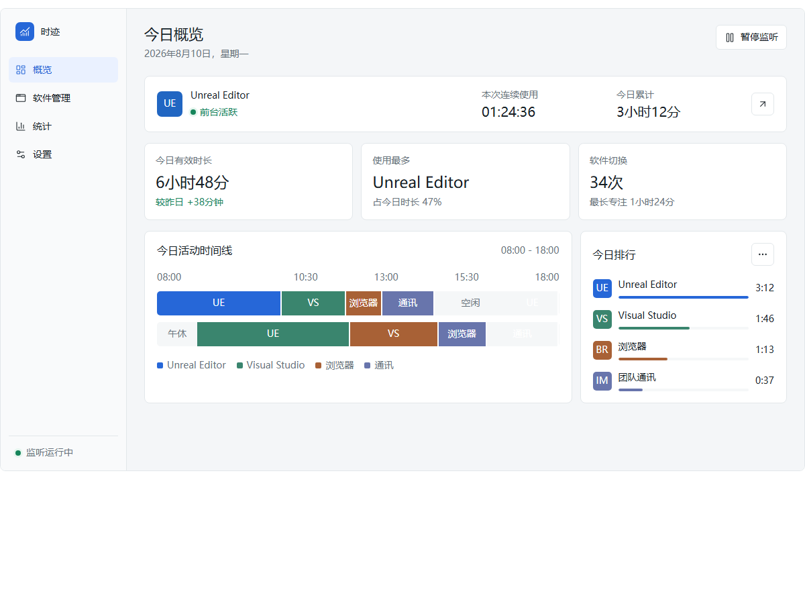
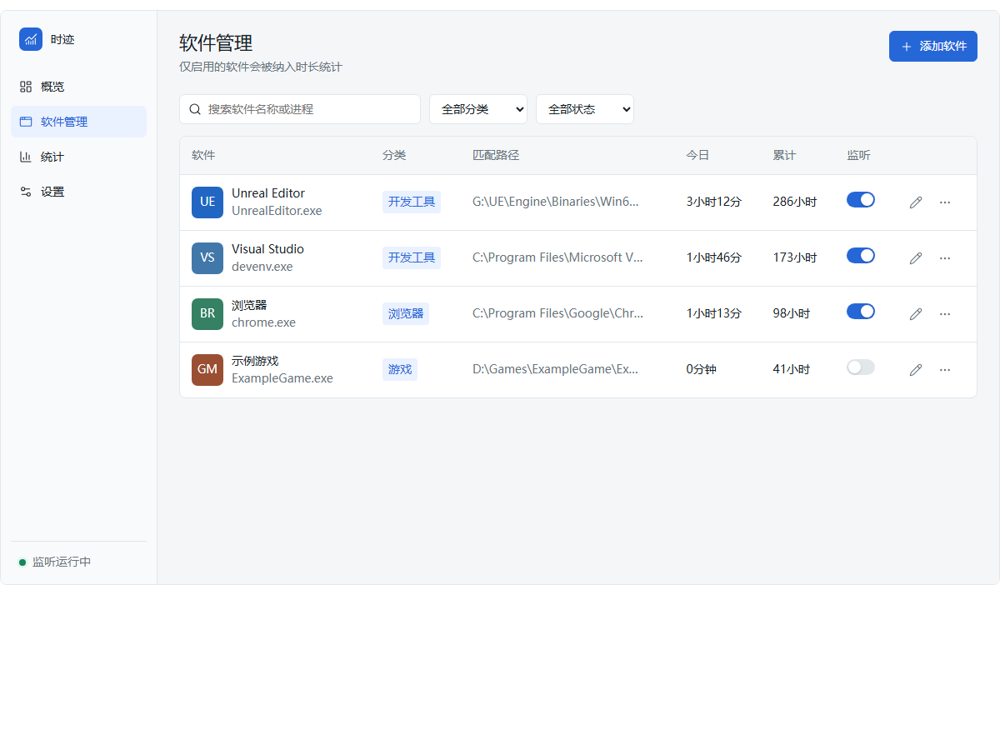
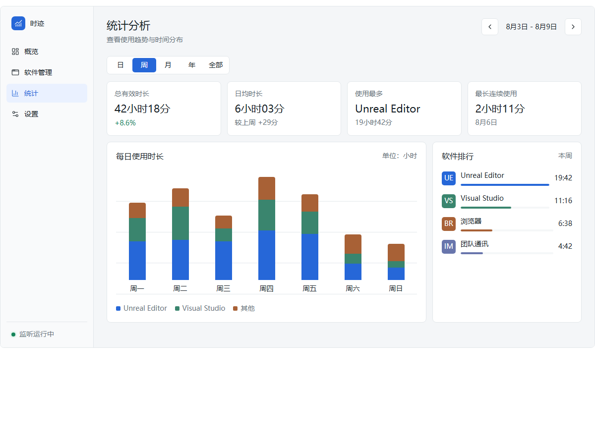
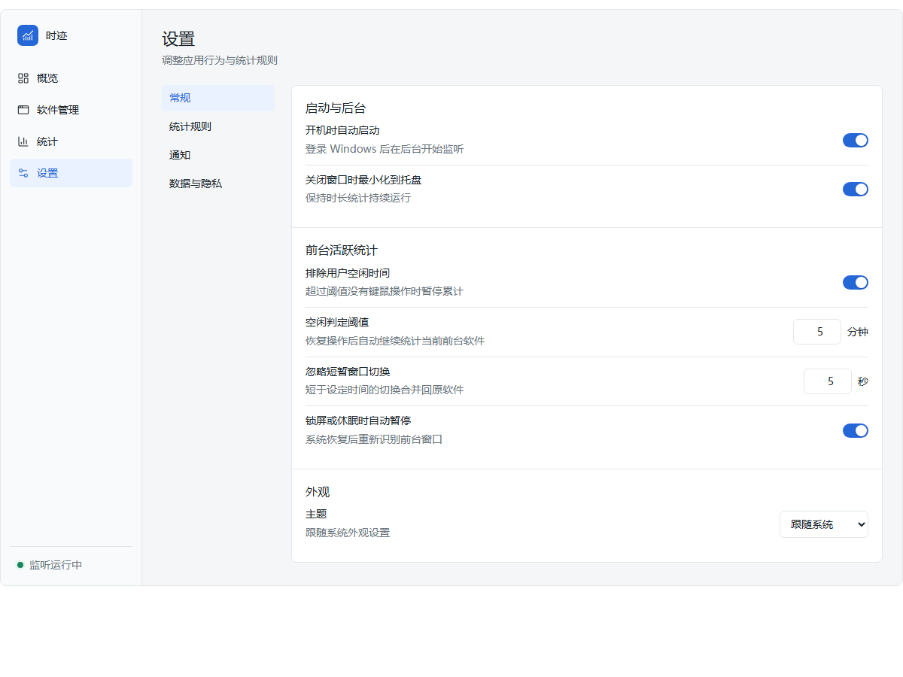

# 时迹 · app-usage-tracker

<div align="center">

**Windows 软件使用时长统计工具**

默认只记录「已配置软件 + 前台激活 + 未锁屏/休眠 + 未空闲」的有效使用时长，帮你搞清楚时间都花在了哪里。

[](https://dotnet.microsoft.com/)
[](#环境要求)
[](#许可)

</div>

## ✨ 特性

- **前台有效统计**：只统计已配置并启用的软件；锁屏、休眠、空闲、暂停、隐私模式期间不累计时长。
- **原始会话可追溯**：每次开始 / 结束 / 原因都有记录，统计结果可从会话重建，支持补录、修改、合并、删除。
- **多维度统计**：日 / 周 / 月 / 年 / 全部时间，含软件排行、趋势柱状图和软件详情。
- **今日概览**：当前软件、连续与累计时长、可缩放的活动时间线和今日排行。
- **托盘常驻**：后台运行、托盘菜单、开机自启、浅 / 深主题、全局快捷键呼出 / 隐藏。
- **本地优先**：数据仅存本机（JSON），支持备份、恢复、完整性检查与 CSV 导出。

## 🖼️ 界面预览

> 以下为早期界面设计稿，实际界面以运行效果为准。

| 概览 | 软件管理 |
| --- | --- |
|  |  |

| 统计分析 | 设置 |
| --- | --- |
|  |  |

## 🚀 快速开始

### 环境要求

- Windows 10 / 11
- [.NET 8 SDK](https://dotnet.microsoft.com/download/dotnet/8.0)
- Git Bash（用于运行 `manager.sh` / `check-docs.sh`）

### 构建与运行

```bash
sh manager.sh build   # 构建解决方案
sh manager.sh start   # 启动应用
```

### 常用命令

| 命令 | 说明 |
| --- | --- |
| `sh manager.sh build` | 构建解决方案 |
| `sh manager.sh start` | 启动 WPF 应用 |
| `sh manager.sh test` | 运行单元测试 |
| `sh manager.sh pack` | 发布 win-x64 自包含单文件到 `dist/` |
| `sh manager.sh release <version>` | 升级版本号并打包单文件（本地，不含 git/CHANGELOG） |
| `sh manager.sh icon` | 重新生成应用图标（`Assets/app.ico` + `app.png`） |
| `sh manager.sh clean` | 清理构建与运行产物 |
| `sh manager.sh help` | 显示帮助 |

Windows 用户也可不装 Git Bash，直接双击运行 `.bat` 脚本：

| 脚本 | 说明 |
| --- | --- |
| `build.bat` | 构建解决方案（参数 `Debug`/`Release`） |
| `test.bat` | 运行单元测试（参数 `Debug`/`Release`） |
| `publish.bat` | 发布自包含单文件到 `dist/`（参数 `self`/`fx`） |
| `clean.bat` | 清理 `bin`/`obj`/`dist` |
| `ci.bat` | 一键流水线：clean → build Release → test Release → publish self |

## 🧱 技术栈

| 领域 | 选型 |
| --- | --- |
| 语言 / 运行时 | C# / .NET 8（`net8.0-windows`） |
| 桌面 UI | WPF |
| 架构模式 | MVVM（CommunityToolkit.Mvvm 8.3.2） |
| 前台监听 | Win32 P/Invoke（WinEventHook / 前台窗口） |
| 持久化 | System.Text.Json（本地 JSON，原子写入） |
| 系统托盘 | WinForms NotifyIcon |
| 测试 | xUnit |

## 📁 项目结构

```text
app-usage-tracker/
├── src/AppUsageTracker/          WPF 主项目（Models/Services/ViewModels/Views/Themes/Controls）
├── tests/AppUsageTracker.Tests/  xUnit 单元测试
├── docs/                         使用、技术、设计与开发计划文档
├── tools/                        图标生成与 UI 截图脚本
├── manager.sh                    统一构建入口（build/start/test/pack/clean）
├── ARCHITECTURE.md               代码链路图谱
├── CHANGELOG.md                  版本里程碑
└── HANDOFF.md                    开发接力状态
```

## 📚 文档

- [使用说明](docs/02-使用说明.md)
- [技术栈说明](docs/01-技术栈说明.md)
- [产品设计文档](docs/design/software-usage-duration-design.md)
- [架构图谱](ARCHITECTURE.md)

## ⚖️ 许可

本项目暂未指定开源许可，使用与分发前请先确认。
