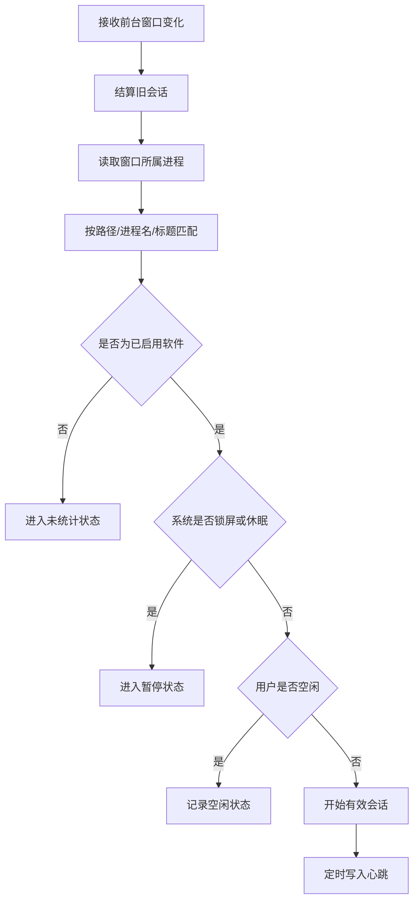

# 软件使用时长统计工具设计文档

> 文档状态：方案设计  
> 目标平台：Windows  
> 更新日期：2026-08-10

## 1. 文档目标

本文档定义“软件使用时长统计工具”的产品范围、统计口径、界面布局、技术选型、核心架构、数据模型和开发阶段。

技术方案采用成熟的 C#、WPF、MVVM、JSON 持久化、系统托盘和测试方案，监听逻辑以“前台窗口是否有效使用”为核心。

## 2. 产品定位

一款本地优先、低打扰的 Windows 桌面工具，用于统计用户日常使用软件和游戏的时长，并提供按日、周、月、年和全部时间范围的趋势分析。

产品默认只统计用户主动配置的软件，以“前台有效时长”作为主要指标。

### 2.1 产品目标

- 准确记录用户实际使用软件的时间。
- 帮助用户了解时间分布、使用趋势和专注情况。
- 长期驻留后台，同时保持较低的资源占用。
- 所有统计数据均可追溯、修正和导出。
- 默认只在本机保存数据，不上传软件使用记录。

### 2.2 核心原则

1. 只有已配置并启用的软件才纳入统计。
2. 默认不统计仅在后台运行的进程。
3. 锁屏、休眠和关机期间不累计有效时长。
4. 默认不采集窗口标题、文档名称和网址等敏感数据。
5. 原始会话是统计事实来源，汇总数据仅用于查询加速。
6. 用户可以暂停监听、修改记录、导出数据和清除历史。

## 3. 功能范围

### 3.1 核心页面

| 页面 | 主要职责 |
| --- | --- |
| 概览 | 展示当前活跃软件、今日摘要、活动时间线和今日排行 |
| 软件管理 | 添加、编辑、启用、停用和删除监听软件 |
| 统计分析 | 按日、周、月、年和全部时间分析使用趋势 |
| 时间记录 | 查看和修正原始使用会话 |
| 设置 | 管理启动、监听、空闲、通知、数据和隐私选项 |

### 3.2 系统托盘

托盘菜单提供：

- 当前活跃软件及本次使用时长。
- 暂停或继续监听。
- 添加当前前台软件。
- 打开今日概览。
- 切换隐私模式。
- 退出程序。

## 4. 统计口径

### 4.1 时长类型

| 类型 | 定义 | 使用方式 |
| --- | --- | --- |
| 运行时长 | 软件进程从启动到退出的持续时间 | 可选指标，适用于渲染或挂机程序 |
| 前台时长 | 软件窗口处于系统前台激活状态的时间 | 反映软件占据用户桌面的时间 |
| 有效时长 | 软件处于前台，且系统未锁屏、休眠，用户未被判定为空闲的时间 | 默认统计指标 |

### 4.2 默认累计条件

只有同时满足以下条件才累计有效时长：

- 软件已经配置并启用。
- 软件窗口处于系统前台激活状态。
- 系统未锁屏或休眠。
- 用户未超过空闲阈值。
- 全局监听未暂停。
- 当前未启用隐私模式。

### 4.3 前台切换规则

前台窗口发生变化时：

1. 结算旧软件的当前会话。
2. 获取新窗口所属进程。
3. 读取并规范化可执行文件路径。
4. 匹配用户配置的软件条目。
5. 匹配成功后开启新会话。
6. 未匹配成功则进入“不统计”状态。

默认情况下，软件或游戏切换到后台后，不再继续累计有效时长。

### 4.4 空闲规则

默认空闲阈值建议为 5 分钟：

- 超过阈值没有键盘或鼠标输入时暂停累计。
- 用户恢复输入后，重新识别当前前台窗口。
- 空闲时段单独记录，以便时间线展示和数据修正。

空闲策略支持按软件覆盖：

- 视频播放器可以忽略键鼠空闲。
- 使用手柄的游戏可以配置更长阈值或关闭空闲排除。
- 渲染软件可以单独选择“运行时长”模式。

### 4.5 短暂切换

通知弹窗、任务栏、开始菜单和音量面板可能造成短暂的前台切换。

建议默认：

- 短暂切换阈值为 5 秒。
- 小于阈值的系统窗口切换合并回原软件。
- 原始事件保留，展示和汇总使用合并后的会话。

### 4.6 时间处理

- 跨越零点的会话按自然日自动拆分。
- 时间戳以 UTC 保存，展示时转换为本地时间。
- 持续时间使用 `Stopwatch` 或 `GetTickCount64` 计算。
- 用户修改系统时间不影响已经累计的持续时长。
- 异常退出后依据最后心跳修复未结束会话。

## 5. 界面设计

### 5.1 设计原则

- 采用单主窗口结构，降低多个独立窗口之间的切换成本。
- 左侧固定一级导航，右侧展示当前功能页面。
- 保持浅色、紧凑、工具型的 WPF 视觉风格。
- 卡片圆角不超过 8px，减少装饰，突出数据扫描效率。
- 使用系统字体、标准控件和稳定尺寸，便于 WPF 实现。
- 图标按钮使用一致的线性图标，并提供 Tooltip。

### 5.2 主窗口布局

```text
┌────────────────┬───────────────────────────────────────────────┐
│ 品牌与导航     │ 页面标题、时间范围、页面级操作                │
│                ├───────────────────────────────────────────────┤
│ 概览           │                                               │
│ 软件管理       │ 当前页面内容                                  │
│ 统计分析       │                                               │
│ 时间记录       │                                               │
│ 设置           │                                               │
│                │                                               │
│ 监听状态       │                                               │
└────────────────┴───────────────────────────────────────────────┘
```

建议主窗口尺寸：

- 默认尺寸：`1200 × 780`。
- 最小尺寸：`960 × 640`。
- 左侧导航宽度：`176-188px`。
- 内容区域采用自适应 Grid，不使用固定像素堆叠页面。

### 5.3 概览页

概览页回答两个问题：

1. 现在正在统计什么？
2. 今天的时间花在哪里？

主要区域：

- 当前前台软件、本次连续时长和今日累计时长。
- 今日有效时长、使用最多的软件和软件切换次数。
- 一天内的软件活动时间线。
- 今日软件使用排行。
- 暂停或恢复监听操作。


当前前台软件尚未配置时，显示：

> 当前使用的软件尚未纳入统计

并提供“添加当前软件”快捷入口。

### 5.4 软件管理页

软件管理页用于维护监听范围，只有启用的软件才进入正式统计。

支持：

- 搜索软件名称、进程名和路径。
- 按分类和启用状态筛选。
- 显示今日时长、累计时长和监听状态。
- 从当前运行程序中选择。
- 浏览并选择可执行文件。
- 从近期检测记录中添加。
- 批量启用、停用和删除。


软件条目包含：

| 字段 | 说明 |
| --- | --- |
| 显示名称 | 用户可修改的软件名称 |
| 图标 | 默认从可执行文件读取 |
| 可执行文件路径 | 首选匹配依据 |
| 进程名 | 路径不可用时的降级匹配依据 |
| 窗口标题规则 | 可选的包含、排除或正则规则 |
| 分类与标签 | 用于筛选及分类统计 |
| 统计模式 | 有效时长、前台时长或运行时长 |
| 空闲策略 | 跟随全局、忽略空闲或自定义阈值 |
| 多进程合并 | 将相关进程归入同一软件 |
| 启用状态 | 决定是否纳入监听 |

### 5.5 统计分析页

顶部时间粒度：

`日 | 周 | 月 | 年 | 全部`

核心指标：

- 总有效时长。
- 日均使用时长。
- 最常使用的软件。
- 最长连续使用时长。
- 相比上一周期的变化。


不同周期推荐展示：

| 周期 | 展示内容 |
| --- | --- |
| 日 | 24 小时时间线、软件排行、连续使用时段 |
| 周 | 每日堆叠柱状图、周累计时长、与上周对比 |
| 月 | 日历热力图、每日趋势、工作日与休息日对比 |
| 年 | 月度趋势、分类占比、年度高频软件 |
| 全部 | 累计趋势、历史排行、首次与最近使用时间 |

点击软件后进入详情视图，展示：

- 今日、近 7 天、近 30 天和累计时长。
- 每日首次与最后使用时间。
- 连续使用时段。
- 使用趋势。
- 原始会话记录。

### 5.6 时间记录页

时间记录页按时间顺序展示原始会话：

```text
09:12-10:03  Unreal Editor  51分钟
10:03-10:18  Visual Studio  15分钟
10:18-10:31  空闲           13分钟
```

支持：

- 修改开始和结束时间。
- 删除异常记录。
- 手动补录。
- 合并相邻记录。
- 标记为空闲或忽略。
- 查看记录产生原因。
- 保留人工修正来源。

### 5.7 设置页

设置页按类别分为：

- 常规。
- 统计规则。
- 通知。
- 数据与隐私。


推荐默认值：

| 设置 | 默认值 |
| --- | --- |
| 空闲阈值 | 5 分钟 |
| 短暂切换阈值 | 5 秒 |
| 心跳间隔 | 15 秒 |
| 自动保存间隔 | 60 秒 |
| 锁屏和休眠 | 自动暂停 |
| 跨越零点 | 按自然日拆分 |
| 关闭主窗口 | 最小化到托盘 |

## 6. 技术选型

### 6.1 技术基线

| 领域 | 选型 |
| --- | --- |
| 语言和运行时 | C# / .NET 8 |
| 目标框架 | `net8.0-windows` |
| 桌面 UI | WPF |
| 架构模式 | MVVM |
| MVVM 库 | CommunityToolkit.Mvvm 8.3.2 |
| 进程检测 | `System.Diagnostics.Process` + Win32 前台事件监听 |
| 后台计时 | `System.Timers.Timer`（心跳和定时保存） |
| UI 刷新 | `DispatcherTimer` |
| 持久化 | `System.Text.Json` |
| 系统托盘 | WinForms `NotifyIcon` |
| 单元测试 | xUnit 2.5.3 |
| 覆盖率 | coverlet.collector 6.0.0 |
| 测试运行器 | Microsoft.NET.Test.Sdk 17.8.0 |
| 发布方式 | `win-x64` 自包含单文件 EXE |

### 6.2 技术选型结论

主项目建议使用：

```text
C# / .NET 8
WPF
CommunityToolkit.Mvvm 8.3.2
System.Diagnostics.Process
Win32 P/Invoke
System.Timers.Timer
DispatcherTimer
System.Text.Json
WinForms NotifyIcon
xUnit + coverlet
```

运行期只保留 `CommunityToolkit.Mvvm` 一个主要第三方 NuGet 依赖。

第一阶段不引入：

- Entity Framework Core。
- SQLite。
- 第三方进程检测库。
- 第三方系统托盘库。
- 重型图表框架。

统计图表优先使用 WPF 原生 `ItemsControl`、`Canvas`、`Rectangle`、`Polyline` 和数据模板实现，减少依赖并保持单文件发布稳定。

### 6.3 统计模型差异

早期方案按固定周期枚举进程，只要进程正在运行就累计时间，无法准确表示用户实际使用时长。本方案改为前台窗口事件驱动。

| 能力 | 早期方案 | 本方案 |
| --- | --- | --- |
| 统计对象 | 正在运行的进程 | 前台激活窗口 |
| 累计方式 | 定时轮询后批量加秒 | 前台事件驱动，会话开始/结束 |
| 空闲检测 | 无 | `GetLastInputInfo` |
| 锁屏与休眠 | 无独立会话处理 | 自动暂停并结算 |
| 原始会话 | 无，仅保存每日累计 | 保存每次开始、结束和原因 |
| 统计周期 | 今日、7 天、全部、日期明细 | 日、周、月、年、全部 |
| 手工修正 | 不支持 | 支持修改、删除和补录 |
| 匹配依据 | 进程名或窗口标题 | 完整路径优先，进程名和标题降级 |

因此，本项目保留轻量技术栈和分层方式，但核心统计逻辑由“进程运行即累计”改为“前台窗口有效使用”。

## 7. 系统架构

### 7.1 分层结构

```text
┌──────────────────────────────────────────────────────┐
│ View                                                  │
│ MainWindow + Overview/Apps/Stats/Timeline/Settings   │
│ WPF XAML、数据模板、原生图形                          │
└────────────────────────┬─────────────────────────────┘
                         │ DataBinding
┌────────────────────────▼─────────────────────────────┐
│ ViewModel                                             │
│ MainViewModel / OverviewViewModel / AppsViewModel    │
│ StatsViewModel / TimelineViewModel / SettingsViewModel│
│ CommunityToolkit.Mvvm                                 │
└────────────────────────┬─────────────────────────────┘
                         │
┌────────────────────────▼─────────────────────────────┐
│ Services                                              │
│ ForegroundWindowMonitor / IdleMonitor / SessionMonitor│
│ ApplicationMatcher / ActivitySessionService          │
│ StatisticsService / JsonDataStore / TrayIconService  │
└────────────────────────┬─────────────────────────────┘
                         │
┌────────────────────────▼─────────────────────────────┐
│ Models                                                │
│ TrackedApp / MatchRule / ActivitySession             │
│ DailyAggregate / AppSettings / ManualCorrection      │
└──────────────────────────────────────────────────────┘
```

### 7.2 核心服务

| 服务 | 职责 |
| --- | --- |
| `IForegroundWindowMonitor` | 监听前台窗口切换 |
| `IIdleStateMonitor` | 判断用户是否空闲 |
| `ISystemSessionMonitor` | 监听锁屏、解锁、休眠和恢复 |
| `IProcessDetector` | 枚举运行软件并获取进程信息 |
| `IApplicationMatcher` | 将窗口和进程匹配到软件配置 |
| `IActivitySessionService` | 管理会话开始、结束、心跳和修复 |
| `IStatisticsService` | 计算日、周、月、年和累计统计 |
| `IJsonDataStore` | 配置、会话和汇总数据读写 |
| `ITrayIconService` | 托盘状态和菜单 |

### 7.3 前台监听 API

| API 或事件 | 用途 |
| --- | --- |
| `SetWinEventHook(EVENT_SYSTEM_FOREGROUND)` | 监听前台窗口变化 |
| `GetForegroundWindow()` | 主动获取当前前台窗口 |
| `GetWindowThreadProcessId()` | 获取窗口所属进程 |
| `QueryFullProcessImageName()` | 获取可执行文件路径 |
| `GetLastInputInfo()` | 获取用户空闲时间 |
| `SystemEvents.SessionSwitch` | 监听锁屏、解锁和用户切换 |
| `SystemEvents.PowerModeChanged` | 监听休眠和恢复 |
| `Stopwatch` / `GetTickCount64()` | 计算稳定持续时间 |

### 7.4 监听流程



### 7.5 状态机

```text
Stopped       监听服务未启动
Untracked     当前前台软件未配置
Active        正在累计有效时长
Idle          用户处于空闲状态
Locked        系统处于锁屏状态
Suspended     系统正在休眠
Paused        用户手动暂停
Private       隐私模式
```

状态变化时必须先结束旧状态，再进入新状态，避免重复累计或产生时间空洞。

## 8. 数据设计

### 8.1 持久化方案

使用 `System.Text.Json` 和 `%AppData%\AppUsageTracker\` 数据目录。

建议文件划分：

```text
%AppData%\AppUsageTracker\
  usage_config.json
  activity_sessions.json
  daily_aggregates.json
  manual_corrections.json
  logs\
```

为降低文件损坏风险：

- 写入临时文件后原子替换正式文件。
- 保存前生成 `.bak` 备份。
- 读取失败时回退备份或默认数据。
- 不因单个文件损坏阻断程序启动。
- 达到保留天数后归档或清理历史会话。

### 8.2 核心实体

| 实体 | 主要字段 |
| --- | --- |
| `TrackedApp` | Id、Name、ExecutablePath、ProcessName、Category、Enabled、TrackingMode |
| `MatchRule` | RuleType、Pattern、IsExcluded、Priority |
| `ActivitySession` | AppId、StartedAtUtc、EndedAtUtc、DurationSeconds、State、Source |
| `DailyAggregate` | Date、AppId、EffectiveSeconds、ForegroundSeconds、RunningSeconds |
| `ManualCorrection` | SessionId、Operation、Before、After、CreatedAtUtc |
| `AppSettings` | 启动、托盘、空闲、保存、通知、隐私等设置 |

### 8.3 ActivitySession

```text
Id
ApplicationId
StartedAtUtc
EndedAtUtc
DurationSeconds
ActivityType
EndReason
IdleSeconds
LastHeartbeatAtUtc
IsManual
CreatedAtUtc
UpdatedAtUtc
```

原始会话是唯一事实来源：

- 汇总结果可以从会话重新生成。
- 修改会话后重新计算受影响日期。
- 同一设备同一时间只能有一个有效前台会话。
- 会话跨越零点时拆成两个记录。

## 9. 项目结构建议

保持单 WPF 项目的轻量结构：

```text
app-usage-tracker/
  Models/
    TrackedApp.cs
    ActivitySession.cs
    AppSettings.cs
  Services/
    ForegroundWindowMonitor.cs
    IdleStateMonitor.cs
    SystemSessionMonitor.cs
    ApplicationMatcher.cs
    ActivitySessionService.cs
    JsonDataStore.cs
    StatisticsService.cs
    TrayIconService.cs
    TrackingContext.cs
  ViewModels/
    MainViewModel.cs
    OverviewViewModel.cs
    AppsViewModel.cs
    StatisticsViewModel.cs
    TimelineViewModel.cs
    SettingsViewModel.cs
  Views/
    OverviewView.xaml
    AppsView.xaml
    StatisticsView.xaml
    TimelineView.xaml
    SettingsView.xaml
  Themes/
    Theme.xaml
```

当项目规模明显扩大后，再考虑拆分 Domain、Application 和 Infrastructure 项目，不在 MVP 阶段提前增加工程复杂度。

## 10. 异常场景

需要重点处理和测试：

- 工具或目标软件崩溃。
- 电脑休眠、恢复、锁屏和解锁。
- 用户切换 Windows 会话。
- 会话跨越午夜。
- 用户修改系统时间或时区。
- 通知弹窗造成快速窗口切换。
- 同名进程位于不同目录。
- UWP、Electron 和浏览器多进程应用。
- 游戏启动器和游戏本体切换。
- 管理员权限进程路径读取失败。
- 全屏独占游戏。
- 远程桌面和虚拟机。
- 数据文件损坏、磁盘空间不足和重复记录。

## 11. 性能目标

| 指标 | 目标 |
| --- | --- |
| 空闲 CPU 占用 | 平均低于 0.5% |
| 常驻内存 | 低于 150 MB |
| 前台切换识别延迟 | 低于 500ms |
| 异常退出数据损失 | 不超过一个心跳周期 |
| 常规统计查询 | 500ms 内完成 |
| 启动到监听就绪 | 2 秒内完成 |

## 12. 测试策略

使用 xUnit 测试体系。

重点单元测试：

- 路径、进程名和窗口标题匹配。
- 前台切换后旧会话正确结束。
- 空闲、锁屏和暂停状态不累计时长。
- 跨越零点正确拆分。
- 短暂切换正确合并。
- 心跳正确更新。
- 异常会话正确修复。
- 修改原始记录后汇总正确刷新。
- JSON 损坏后能够回退。
- 保存时过滤无效记录。

Win32 API 通过接口封装，测试时注入假窗口事件、假时间源和假系统状态，避免单元测试依赖真实桌面环境。

## 13. 开发阶段

### 13.1 MVP

- [ ] 单主窗口和左侧导航。
- [ ] 软件添加、编辑、启用和停用。
- [ ] 前台窗口事件监听。
- [ ] 有效时长会话记录。
- [ ] 空闲、锁屏和休眠检测。
- [ ] 概览页和今日活动时间线。
- [ ] 日、周、月和累计统计。
- [ ] 系统托盘运行。
- [ ] JSON 本地持久化。
- [ ] CSV 数据导出。
- [ ] 异常退出会话修复。

### 13.2 第二阶段

- [ ] 时间记录修改和手动补录。
- [ ] 分类、标签和软件详情。
- [ ] 年度统计和日历热力图。
- [ ] 每日摘要和连续使用提醒。
- [ ] 数据备份、恢复和完整性检查。
- [ ] 自动发现近期使用的软件。

### 13.3 后续增强

- [ ] 浏览器网站维度统计。
- [ ] 软件使用目标和时间限制。
- [ ] 多设备同步。
- [ ] 插件机制和开放 API。
- [ ] macOS 和 Linux 版本。

## 14. MVP 验收标准

1. 已配置软件进入前台后，在 500ms 内开始累计。
2. 切换到其他窗口后，旧软件停止累计。
3. 未配置软件不会进入正式统计。
4. 锁屏、休眠、空闲和暂停期间不累计有效时长。
5. 跨越零点的会话正确拆分。
6. 程序异常退出后可以根据心跳修复会话。
7. 日、周、月和累计数据能够从原始会话正确生成。
8. 用户修改原始会话后，汇总结果同步更新。
9. 程序能够长期在托盘运行并满足性能目标。
10. `dotnet test` 全部通过，发布产物可以生成自包含单文件 EXE。

## 15. 结论

本项目采用轻量 Windows 技术栈：

- `.NET 8 + WPF`。
- `CommunityToolkit.Mvvm`。
- `System.Text.Json`。
- WinForms `NotifyIcon`。
- xUnit。
- 自包含单文件发布。

核心升级点不是更换框架，而是将统计模型从“进程正在运行”改为“前台窗口有效使用”，并增加原始会话、空闲状态、系统会话、数据修正和多周期统计能力。
